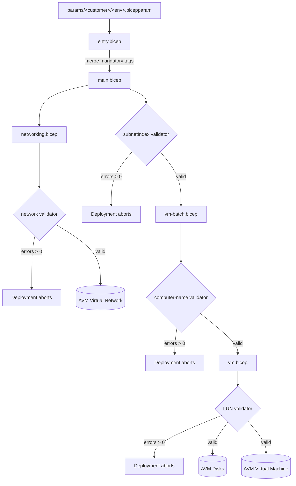

# Architecture

A multi-customer VM platform factory. **One parameter file describes one customer
environment**; each environment deploys to its own resource group
`rg-<customer>-<environmentName>`.

## Deployment flow



## Components

| File | Responsibility |
| --- | --- |
| `infra/entry.bicep` | Public contract; merges mandatory tags; forwards to `main`. |
| `infra/main.bicep` | Orchestrator: networking + VM batch loop; `subnetIndex` validation. |
| `infra/modules/types.bicep` | Shared `@export()` user-defined types. |
| `infra/modules/validator.bicep` | Generic `maxValue(0)` fail-fast guard (no resources). |
| `infra/modules/networking.bicep` | CIDR/subnet validation + AVM VNet. |
| `infra/modules/vm-batch.bicep` | Computer-name validation + VM loop. |
| `infra/modules/vm.bicep` | Single VM via AVM + standalone managed data disks. |
| `scripts/deploy.sh` | Production deployment driver (what-if, poll, report). |
| `.github/workflows/deploy.yml` | Manual CI/CD with OIDC. |

## Fail-fast pattern: `maxValue(0)` + `any()`

`validator.bicep` declares no resources. It only exposes:

```bicep
@minValue(0)
@maxValue(0)
param errorCount int
```

Callers collect an array of error strings and pass `errorCount: any(length(errors))`.

- **Why `any()` is required.** Bicep statically narrows `length([])` to the literal
  type `0`. When the analyzer compares that literal against `@maxValue(0)` it can raise
  `BCP036`. Wrapping with `any()` erases the literal type to `any`, so the template
  compiles. At **deploy time** ARM still enforces `@maxValue(0)`, so any non-zero error
  count fails template validation **before a single resource is created**.
- Real resources `dependsOn` the relevant validator module, guaranteeing they never
  start when the configuration is invalid.

## Validation rules

**Networking** (`networking.bicep`):
- Every VNet/subnet `addressPrefix` is a syntactically valid IPv4 CIDR.
- Each subnet sits fully inside at least one VNet prefix (integer range containment).
- No two subnets overlap or duplicate (pairwise integer range comparison; a lambda
  closes over the outer loop index).
- Subnet `usage` is one of the allowed values.
- Subnets are not smaller than `/29`.
- Invalid CIDRs are routed through a `safeCidr` helper (mapped to a non-overlapping
  sentinel `/32`) so the range math stays total.

**Compute** (`vm-batch.bicep`):
- A `computerNameOverride` may not be reused across a multi-VM batch.
- Overrides must be valid per OS (Linux: non-empty, ≤64, valid chars; Windows:
  non-empty, ≤15, valid chars, not all-numeric).
- A safe fallback `take(toLower('vm${uniqueString(...)}'), maxLen)` replaces any invalid
  proposed name.

**Compute** (`vm.bicep`):
- Data-disk `lun` values are unique within a VM (each duplicate reported once; disks
  `dependsOn` the LUN validator).

**Main** (`main.bicep`):
- Every batch `subnetIndex` is within `0 .. subnetCount-1`. The index is clamped
  defensively when indexing subnet outputs; the validator hard-fails genuine
  out-of-range values.

## Naming conventions

| Resource | Pattern |
| --- | --- |
| Resource group | `rg-<customer>-<environmentName>` |
| Virtual network | `vnet-<customer>-<environmentName>` |
| Subnet | `<name>-NN` (zero-padded ordinal) |
| Virtual machine | `<batch>-NN` |
| OS disk | `<vm>-osdisk` |
| Data disk | `<vm>-datadisk-NN` |
| Computer-name fallback | `take(toLower('vm' + uniqueString(...)), maxLen)` |

## Zone mapping

| `zone` value | AVM `availabilityZone` |
| --- | --- |
| `none` (default) | `-1` |
| `1` / `2` / `3` | `1` / `2` / `3` |

## Outputs

| Output | Description |
| --- | --- |
| `vnetResourceId` | Resource ID of the virtual network. |
| `vnetName` | Name of the virtual network. |
| `subnets` | Resolved subnets (`subnetOutputT[]`). |
| `vmNamesByBatch` | VM names grouped per batch. |

No secret is ever emitted as an output.
